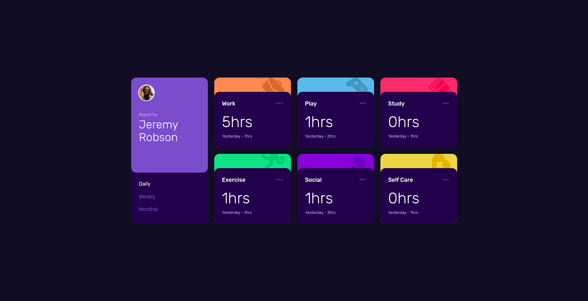
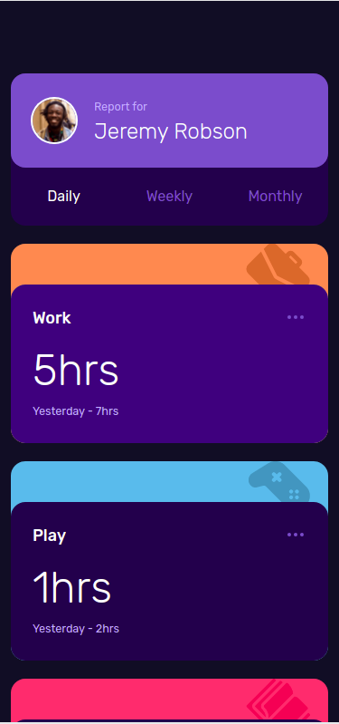
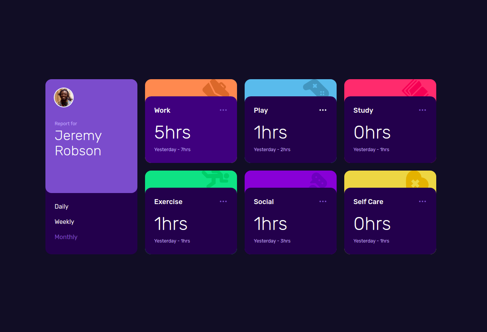

# Frontend Mentor - Time tracking dashboard solution

This is a solution to the [Time tracking dashboard challenge on Frontend Mentor](https://www.frontendmentor.io/challenges/time-tracking-dashboard-UIQ7167Jw). Frontend Mentor challenges help you improve your coding skills by building realistic projects.

## Table of contents

- [Overview](#overview)
  - [The challenge](#the-challenge)
  - [Screenshot](#screenshot)
  - [Links](#links)
- [My process](#my-process)
  - [Built with](#built-with)
  - [What I learned](#what-i-learned)
  - [Continued development](#continued-development)
  - [Useful resources](#useful-resources)
- [Author](#author)
- [Acknowledgments](#acknowledgments)

## Overview

### The challenge

Users should be able to:

- View the optimal layout for the site depending on their device's screen size
- See hover states for all interactive elements on the page
- Switch between viewing Daily, Weekly, and Monthly stats

### Screenshot

### Links

- Solution URL: [Github Repo](https://github.com/BayuRidhoAlkhifli/time-tracking-dashboard-main)
- Live Site URL: [Live Site](https://bayuridhoalkhifli.github.io/time-tracking-dashboard-main)

## My process

### Built with

- Semantic HTML5 markup
- CSS custom properties
- Flexbox
- CSS Grid
- Mobile-first workflow
- [React](https://reactjs.org/) - JS library
- [Tailwind CSS](https://tailwindcss.com/) - For styles

### What I learned

For the first time I'm trying to explore using Tailwind CSS framework for styling in my project. The lesson I took from this project is that Tailwind CSS is easier to style without needing to change styles in CSS files or write inline styles in coding.

### Continued development

This was a simple dashboard project from Front-End Mentor, so I think it's just for some practice and to have some fun. So, I'll leave it with no further changes.

### Useful resources

- [React JS](https://reactjs.org/docs/getting-started.html) - This website helped me to install React JS library and helped me when I forgot how to use API HOOK in React JS.
- [Tailwind CSS](https://tailwindcss.com) - This website helped me understand Tailwind CSS.

## Author

- Website - [Sibayu.id](https://sibayu.id/)
- Frontend Mentor - [@BayuRidhoAlkhifli](https://www.frontendmentor.io/profile/BayuRidhoAlkhifli)
- Github - [BayuRidhoAlkhifli](https://github.com/BayuRidhoAlkhifli)

## Acknowledgments

Thanks to Front-End Mentor for this project and for providing me with beautiful design files to make this project.
